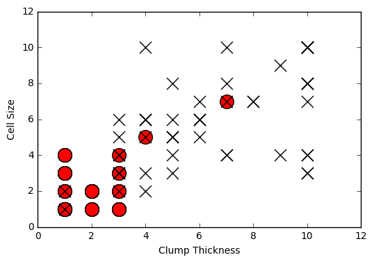
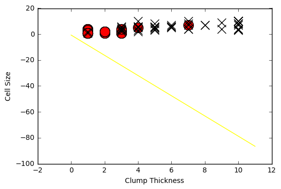

```python
import pandas as pd
```


```python
df_train = pd.read_csv('../Datasets/Breast-Cancer/breast-cancer-train.csv')

df_test = pd.read_csv('../Datasets/Breast-Cancer/breast-cancer-test.csv')

```


```python
df_test_negative = df_test.loc[df_test['Type'] == 0][['Clump Thickness', 'Cell Size']]
df_test_positive = df_test.loc[df_test['Type'] == 1][['Clump Thickness', 'Cell Size']]
```


```python
import matplotlib.pyplot as plt

plt.scatter(df_test_negative['Clump Thickness'],df_test_negative['Cell Size'], marker = 'o', s=200, c='red')
plt.scatter(df_test_positive['Clump Thickness'],df_test_positive['Cell Size'], marker = 'x', s=150, c='black')

plt.xlabel('Clump Thickness')
plt.ylabel('Cell Size')

plt.show()

```





```python
import numpy as np

intercept = np.random.random([1])
coef = np.random.random([2])

lx = np.arange(0, 12)
ly = (-intercept - lx * coef[0]) / coef[1]

plt.plot(lx, ly, c='yellow')


plt.scatter(df_test_negative['Clump Thickness'],df_test_negative['Cell Size'], marker = 'o', s=200, c='red')
plt.scatter(df_test_positive['Clump Thickness'],df_test_positive['Cell Size'], marker = 'x', s=150, c='black')
plt.xlabel('Clump Thickness')
plt.ylabel('Cell Size')
plt.show()


```





```python
from sklearn.linear_model import LogisticRegression
lr = LogisticRegression()

lr.fit(df_train[['Clump Thickness', 'Cell Size']][:10], df_train['Type'][:10])
print ('Testing accuracy (10 training samples):', lr.score(df_test[['Clump Thickness', 'Cell Size']], df_test['Type']))

```

    Testing accuracy (10 training samples): 0.868571428571


```python
intercept = lr.intercept_
coef = lr.coef_[0, :]

ly = (-intercept - lx * coef[0]) / coef[1]

plt.plot(lx, ly, c='green')
plt.scatter(df_test_negative['Clump Thickness'],df_test_negative['Cell Size'], marker = 'o', s=200, c='red')
plt.scatter(df_test_positive['Clump Thickness'],df_test_positive['Cell Size'], marker = 'x', s=150, c='black')
plt.xlabel('Clump Thickness')
plt.ylabel('Cell Size')
plt.show()
```


```python
lr = LogisticRegression()

lr.fit(df_train[['Clump Thickness', 'Cell Size']], df_train['Type'])
print 'Testing accuracy (all training samples):', lr.score(df_test[['Clump Thickness', 'Cell Size']], df_test['Type'])

```

    Testing accuracy (all training samples): 0.937142857143


```python
intercept = lr.intercept_
coef = lr.coef_[0, :]
ly = (-intercept - lx * coef[0]) / coef[1]

plt.plot(lx, ly, c='blue')
plt.scatter(df_test_negative['Clump Thickness'],df_test_negative['Cell Size'], marker = 'o', s=200, c='red')
plt.scatter(df_test_positive['Clump Thickness'],df_test_positive['Cell Size'], marker = 'x', s=150, c='black')
plt.xlabel('Clump Thickness')
plt.ylabel('Cell Size')
plt.show()
```
